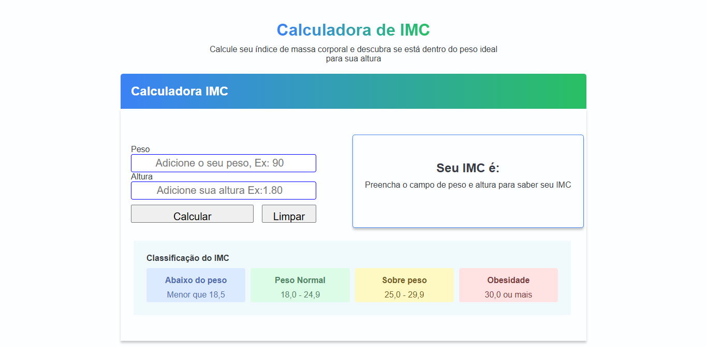

# Calculadora de IMC 🖥️✨



## 📌 Descrição

Projeto desenvolvido em **React** com **JavaScript**, utilizando o **Vite** como bundler.

Este projeto tem como objetivo criar uma aplicação web para **calcular o IMC (Índice de Massa Corporal)** de forma rápida e simples.  
O usuário informa o peso e a altura, e o sistema retorna o resultado com a classificação adequada.

## 🚀 Tecnologias Utilizadas

- [React](https://reactjs.org/)
- [JavaScript](https://developer.mozilla.org/pt-BR/docs/Web/JavaScript)
- [Vite](https://vitejs.dev/)

## 📷 Demonstração

> Adicione aqui imagens ou GIFs mostrando a aplicação funcionando.

## 🛠️ Instalação e Execução Local

```bash
# Clone o repositório
git clone https://github.com/seu-usuario/nome-do-repositorio.git

# Acesse a pasta do projeto
cd nome-do-repositorio

# Instale as dependências
npm install

# Execute o projeto
npm run dev
```
